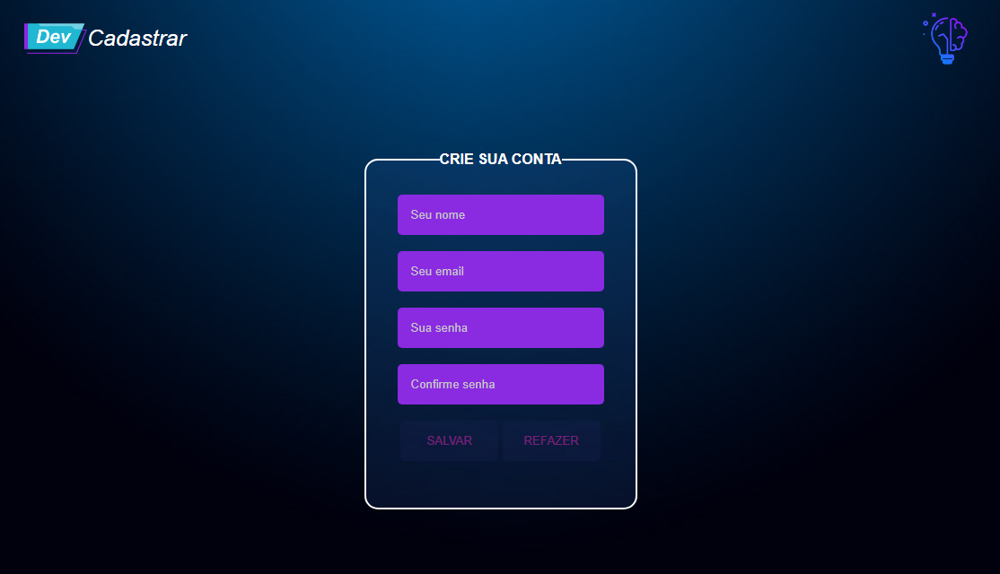
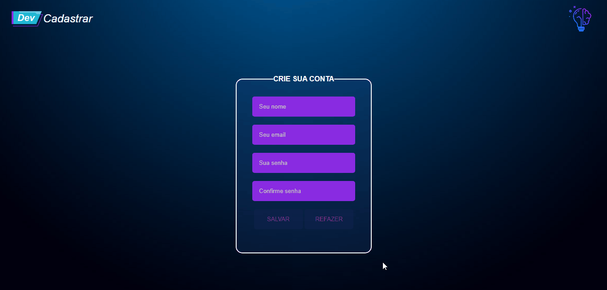

# DEV CADASTRAR
Um pequeno projeto de uma tela de cadastro. Esse projeto foi feito com o intuito de por em prática os conteúdos que estou estudando 📘

[]

## Projeto

[]

## Tecnologias utilizadas
- HTML
- CSS
- JavaScript

## Aprendizagem

### Aprendi novas funcionalidades do JavaScript:
```
document.
```
```
document.querySelector()
```
### Eventos:
```
onfocus
```
```
onblur
```